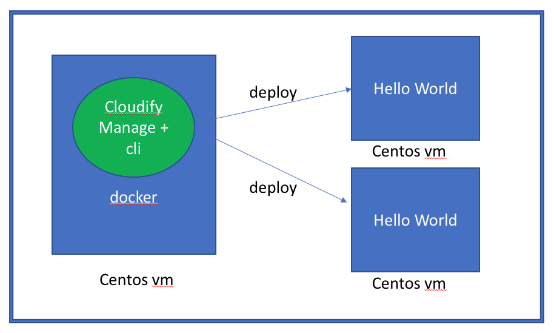

# run manager in docker

In this tutorial, we will install manager & cli in docker, and deploy hello-word into another vm.



## create a directory as the working directory for Vagrant

## download Cloudify (Community) and copy into the working directory

https://cloudify.co/download/

Linux CLI http://repository.cloudifysource.org/cloudify/18.2.1/community-release/cloudify-cli-community-18.2.1.rpm

Linux Manager http://repository.cloudifysource.org/cloudify/18.2.1/community-release/cloudify-manager-install-community-18.2.1.rpm


## boot VM

According to `Vagrantfile`, Vagrant will:

* create a virtual machine hosting Cloudify Manager
* create a virtual machine to start SimpleHTTPServer

> The sanity test does not work correctly, but it seems safe to ignore.

``` bash
vagrant up
```

## Install docker in manager

We will install docker in manager, and run cloudify manager in docker

```
sudo yum-config-manager \
    --add-repo \
        https://mirrors.ustc.edu.cn/docker-ce/linux/centos/docker-ce.repo

sudo yum-config-manager --enable docker-ce-edge
sudo yum install docker-ce
sudo systemctl enable docker
sudo systemctl start docker
```

## Pull and run centos in docker

- We use [https://hub.docker.com/r/centos/systemd/](centos/systemd), to support systemd
- Container should run in `net=host` mode, because the agent in another vm will access the cloudify-manager.

```
docker pull centos/systemd
docker run -dit --privileged --net=host --name=manager centos/systemd
```

## cp files into docker

```
docker cp cloudify-manager-install-community-18.2.1.rpm manager:/
docker cp local-simple-python-webserver-blueprint-4.0 manager:/
```

## install cloudify manager and cli in docker

enter docker:
```
docker exec -it manager bash
```

install dependencies:
```
yum install sudo -y
yum install python-backports-ssl_match_hostname python-setuptools python-backports --assumeyes --verbose
sudo yum install -y openssh-server initscripts logrotate which systemd-sysv openssl
```

install cloudify manager and cli:

```
sudo rpm --install /vagrant/cloudify-manager-install-community-*.rpm --verbose
cfy_manager install --private-ip 192.168.33.2 --public-ip 192.168.33.2 --admin-password "admin" --verbose
cfy profiles use 192.168.33.2 -u admin -p admin -t default_tenant
```

deploy a SimpleHttpServer:
```
cfy blueprint upload -b agent-example  blueprint.yaml --verbose
cfy deployment create -b agent-example example -i '{"host_ip": "192.168.33.3"}' --verbose
cfy executions start -d example install --verbose
```
